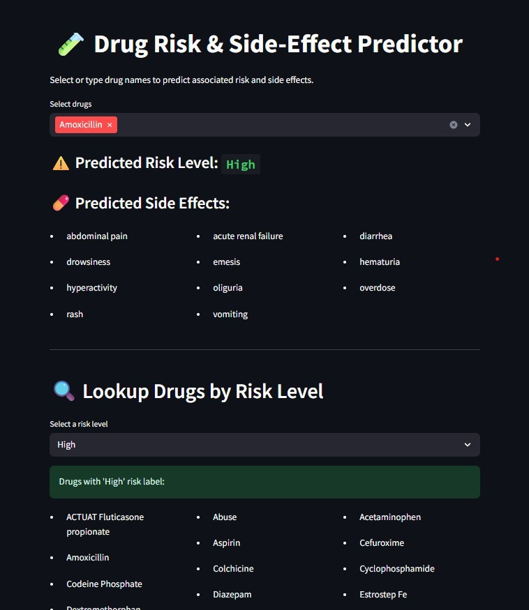

# 🧪 Drug Risk & Side-Effect Predictor – Research Compendium

[](https://www.gnu.org/licenses/gpl-3.0)

> A compendium of reproducible code, models, and data artifacts used to develop a predictive machine learning tool for drug risk classification and side effect analysis.

---

## 🗂️ Overview

This repository follows a **research compendium structure** to ensure that code, data, and outputs are reproducible and extendable.  
The main application is built using **Python** and **Streamlit**. Future updates may include Docker support and a Binder environment.

---

## 🧪 Application Demo

The app allows users to:
- Select multiple drugs
- Predict risk level (`High`, `Medium`, `Low`, `Unknown`)
- Display potential side effects using ML
- Lookup drugs by risk category from a curated dataset

---

## 📁 File Organization

project-root/
├── app.py # Main Streamlit app
├── requirements.txt # Python dependencies
├── Sample.jpg # Screenshot of the app
├── README.md # You're here
├── .gitignore
│
├── src/
│ ├── Dataset_with_Risk_Label.csv # Annotated dataset
│ ├── vectorizer_risk.pkl
│ ├── vectorizer_effects.pkl
│ ├── side_effect_mlb.pkl
│ └── [*.pkl] # Models not pushed (100MB+)
│
├── analysis/
│ ├── logs/
│ │ └── log.md # Log of project changes
│ ├── figures/ # Manuscript figures
│ ├── data/
│ │ ├── rawData/ # External datasets
│ │ └── derivedData/ # Processed tables
│ └── supplementaryMaterials/
│ ├── supplementaryFigures/
│ └── supplementaryTables/


---

## 📸 Screenshot



---

## 🛠️ Run Locally

```bash
git clone https://github.com/INFO-698-InfoSci-Capstone/healthcare-personalization-ai.git
cd healthcare-personalization-ai

python -m venv .venv
.venv\Scripts\activate    # On Windows
pip install -r requirements.txt

streamlit run app.py

📚 License
This work is licensed under the GNU GPL v3 License.

✍️ Author & Contributions
Capstone Team – INFO 698
University of Arizona – 2025 Cohort
Advisor: Prof. Greg Chism